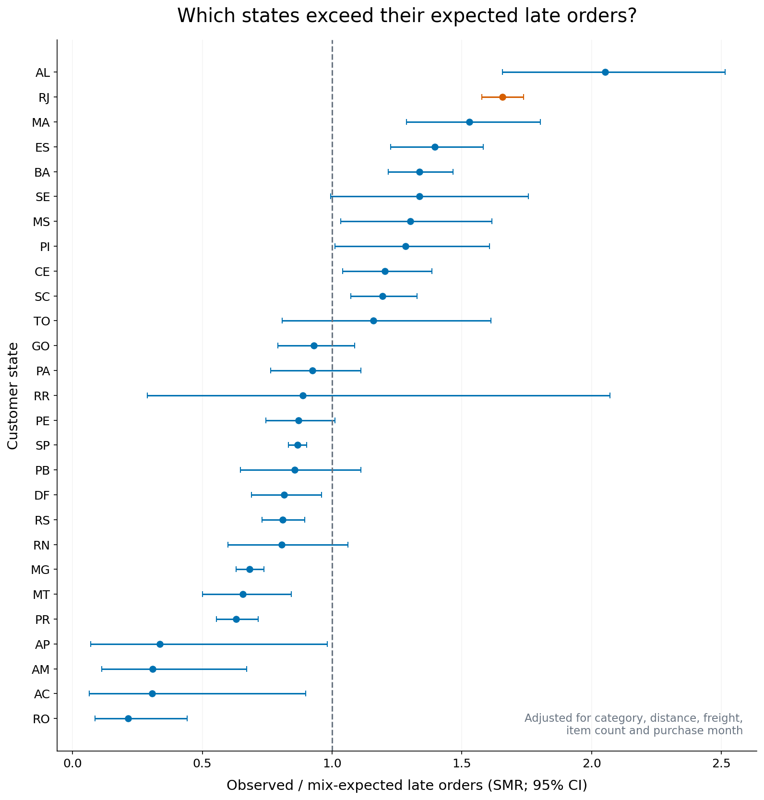
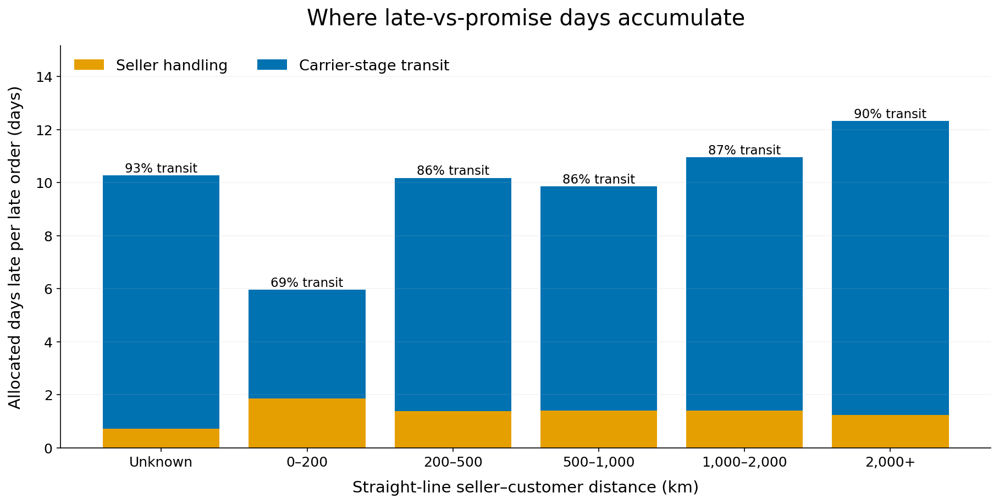
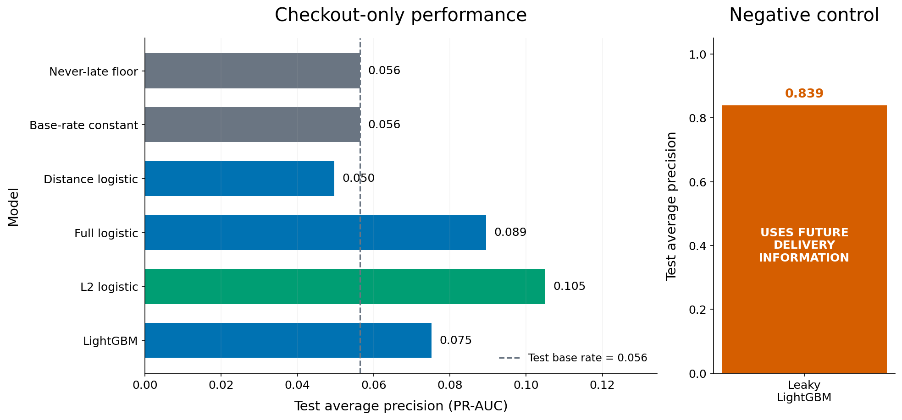

# OnTime

**E-commerce delivery-risk and operational-driver analytics — DuckDB, SQL and Python.** Do not deploy the checkout model as a paid-intervention trigger under the base assumptions.

- **Rio de Janeiro:** adjusted SMR **1.66** (95% CI **1.58–1.74**), with **658** excess late orders.
- **Seller action queue:** **11 sellers**, **3.6%** of orders, aggregate SMR **1.82**, **239** excess orders; volume threshold and FDR screening are explicit.
- **Longer routes:** **86.9%** of allocated late days beyond 200 km sit in the carrier stage, under a descriptive benchmark convention.
- **Economics:** base active candidate needs **86.4% effectiveness** to break even; **3/27** sensitivity scenarios have positive held-out value.



Read the **[decision memo](docs/DECISION_MEMO.md)** for the recommendation and **[methods](docs/METHODS.md)** for definitions, availability assumptions and uncertainty.



## Honest model results

| Model | ROC-AUC | PR-AUC (AP) | Brier | Log loss | AP floor |
|---|---|---|---|---|---|
| majority_never_late | 0.5000 | 0.0564 | 0.0564 | 0.7787 | 0.0564 |
| base_rate_constant | 0.5000 | 0.0564 | 0.0532 | 0.2169 | 0.0564 |
| distance_logistic | 0.3697 | 0.0497 | 0.0539 | 0.2233 | 0.0564 |
| full_logistic | 0.6193 | 0.0895 | 0.0541 | 0.2445 | 0.0564 |
| regularised_logistic | 0.6995 | 0.1049 | 0.0529 | 0.2068 | 0.0564 |
| lightgbm | 0.6270 | 0.0752 | 0.0541 | 0.2305 | 0.0564 |
| leaky_negative_control | 0.9798 | 0.8392 | 0.0238 | 0.1088 | 0.0564 |



Champion: **regularised logistic**. Validation AP gain for LightGBM over L2 logistic was -0.027951; the predeclared practical tolerance was 0.01. This is a simplicity decision rule, not a significance test.
The checkout-only average precision is the real forecasting result; the leaky control uses information that arrives after checkout and cannot support deployment. PR-AUC here means average precision, not trapezoidal PR area. Log loss clips probabilities at 0.000001 and 0.999999.

Isotonic test ECE worsened from **0.0156** to **0.0419**. Calibrated Brier: **0.0565**; calibrated log loss: **0.2323**. Results are reported as measured, without forcing the prompt's expected improvement.

The active candidate has **11.6%** test precision and **R$-0.289** expected net per incoming order at assumed cost **R$8**, value **R$80**, and effectiveness **50%**. No action is explicitly available; monetary values and efficacy are scenarios, not observed business outcomes.

## Pipeline

```text
Pinned public CSVs → DuckDB typed staging → 28 DQ assertions → order_fact
    → strictly prior ASOF seller/route histories → chronological split
    → model ladder → held-out isotonic calibration → validation-selected policy
    → pooled mix-only standardisation + day decomposition → economic scenarios
    → auditable tables + eight figures + decision memo
```

All warehouse schema, typing, joins and aggregation SQL lives in `.sql` files. Python runners handle execution, modelling, statistical intervals and reporting. Downloads are separate; build, analysis, figures and tests use no network. There is no notebook execution order to reconstruct.

## Reproduce it

Requirements: **Python 3.11+**, Git and GNU Make. Verified locally with Python **3.13.7**; all Python runtime dependencies are pinned. Use Python 3.13 for the closest cross-platform comparison. On Windows, install GNU Make or put a portable `make.exe` on PATH; commands below work in PowerShell with that prerequisite.

```bash
git clone https://github.com/kashakkhushi/ontime-delivery-risk.git
cd ontime-delivery-risk
make all
```

`make all` creates a fresh `.venv`, installs the lock, verifies/downloads raw files, builds the warehouse, runs all analysis, regenerates documentation and eight figures, and runs offline tests. Stage commands are also available:

```bash
make setup
make data       # network only here; valid SHA-256 cache is skipped
make build      # offline warehouse, models, tables and memo
make figures   # offline; reads saved tables only
make test      # offline; approximately sixty tests, under a minute
```

For a full-run determinism check (separate from the fast tests):

```bash
.venv/bin/python scripts/verify_reproducibility.py
# Windows: .venv\Scripts\python.exe scripts/verify_reproducibility.py
```

The check runs the entire statistical pipeline twice and requires byte-identical `outputs/metrics.json`. Same-platform pinned-environment reproducibility is tested; floating-point differences across operating systems or BLAS implementations are not promised to be bitwise identical. The GitHub Actions workflow provides a Linux reproduction path.

### Cohort accounting

| Sequential filter | Retained | Excluded at step |
|---|---|---|
| loaded orders | 99,441 | 0 |
| delivered status | 96,478 | 2,963 |
| complete timestamps | 96,455 | 23 |
| monotone timestamps and valid promise | 95,082 | 1,373 |
| customer and valid items | 95,082 | 0 |

Chronological cutoffs are **2018-03-01** and **2018-06-01**. Fold late rates are **7.67% / 11.95% / 5.64%** (train/validation/test). Training labels must already be known at the training cutoff; separate tuning/calibration/policy windows and the May maturity buffer are described in methods and `development_subsets.csv`.

## Data, attribution and limits

[Brazilian E-Commerce Public Dataset by Olist](https://www.kaggle.com/datasets/olistbr/brazilian-ecommerce), Olist and André Sionek, **CC BY-NC-SA 4.0**. Downloads use a pinned commit from Olist's public GitHub repository, with exact URLs, retrieval dates and SHA-256s in **[data/SOURCE.md](data/SOURCE.md)**. No Kaggle API is used. An earlier malformed mirror was rejected and documented. Raw CSVs and the DuckDB database are ignored; analytical tables, figures and documentation are tracked. Code is MIT; data-derived outputs retain CC BY-NC-SA attribution and terms.

This is a delivered-only, single-marketplace historical cohort. Late is strictly after the recorded promise timestamp, including later on that calendar date. Adjusted comparisons are associations, not causal effects; Poisson CIs omit fitted-expectation uncertainty and clustering. There is no carrier identity, actual route, intervention effect or commercial cost data. Dominant-seller attribution simplifies multi-seller orders, and checkout availability of extract attributes requires production validation.

## Repository layout

```text
data/SOURCE.md, manifest.json, dq_report.md  Provenance and quality report
sql/                                       Warehouse logic and ASOF joins
src/ontime/                                Thin runners and analytical modules
tests/                                    Offline leakage, schema, maths and cost tests
scripts/verify_reproducibility.py           Full statistical rerun comparison
outputs/metrics.json                       Machine-readable results
outputs/tables/                            Every quoted number and memo ledger
outputs/figures/                           Eight PNGs at 150 dpi plus captions
docs/DECISION_MEMO.md, METHODS.md           Recommendation and analytical contract
```
